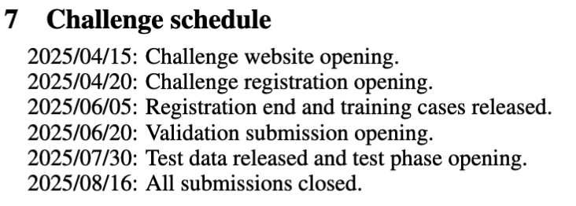

# MONAI VISTA for Lung Fibrosis Segmentation
This is the repository adpated from VISTA3D and VISTA2D. For the older VISTA2.5d code, please checkout the vista2.5d branch

## Conda Environment Name
The project uses the following Conda environment:
`vista3d`

## Dataset
- **Ground Truth**: 20 cases  
  - **Image Directory**: `/home/shengzhang/data/nnUNet/nnUNet_raw/Dataset250_AIIB23Fibrosis/image`  
  Linked to --> `vista3d/data/OSIC/gt_20`
  - **Ground Truth Directory**: `/home/shengzhang/data/nnUNet/nnUNet_raw/Dataset250_AIIB23Fibrosis/gt20250112/nii_gz_filled_consistency4`
  Linked to --> `vista3d/data/OSIC/imgs_20`

- **Unlabeled Images**: 262 cases  
  - **Directory**: `/home/shengzhang/data/nnUNet/nnUNet_raw/Dataset250_AIIB23Fibrosis/AIIB23_all_images`

## Challenge Project Schedule

## Model Input & Output
### Input files as .nii.gz
- Example Image shape: `(512, 512, 424)`, Data type: `Min: -1024.0; Max: 1444.0`
### Saving segmentation files .nii.gz
- Example File name: `xxx_seg.nii.gz`, Image shape: `(512, 512, 424)`, Data type: `float64; Min: 0.0; Max: 1.0`

---

## Monai Functions Explaination
### Purpose of `sliding_window_inferer`:  
The `sliding_window_inferer` performs inference on a large 3D image by dividing it into smaller overlapping patches (or regions of interest, ROIs). Each patch is processed independently, and the results are combined to reconstruct the full image. This method is particularly useful for handling high-resolution 3D images like CT scans.

###  Purpose of `infer_transforms`:  
The `infer_transforms` pipeline ensures consistent preprocessing for high-resolution 3D medical images, making them ready for deep learning inference.
  1. **`LoadImaged`**: Loads the image and metadata from a file.
  2. **`EnsureChannelFirstd`**: Converts the image to channel-first format.
  3. **`ScaleIntensityRanged`**: Normalizes intensity values to a specified range (e.g., `[0, 1]`).
  - It maps the input intensity range `[a_min, a_max]` to the output range `[b_min, b_max]` using the following formula:  
  `output_value = (input_value - a_min) * (b_max - b_min) / (a_max - a_min) + b_min`  
  `Input Range: [-963.8247715525971, 1053.678477684517]`  
  `Output Range: [0.0, 1.0]`
  4. **`Orientationd`**: Reorients the image to a standard anatomical orientation (e.g., `RAS`).
  5. **`Spacingd`**: Resamples the image to uniform voxel spacing (e.g., `[1.0, 1.0, 1.0]` mm).
  6. **`CastToTyped`**: Casts the image to a specific data type (e.g., `float32`).

